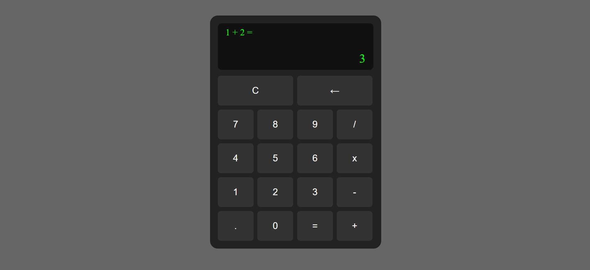

# Calculator

A simple, responsive **calculator app** build with **HTML**, **CSS**, and **JavaScript**.
It supports basic arithmetic operations, error handling and keyboard input

---

    

---

## Features

- Perform basic operations: `+`, `-`, `x`, `÷`
- Error handling (division by zero)
- Keyboard support
- History display of recent operations
- Limit on input length to prevent overflow

---

## Technologies

- **HTML** - structure and layout
- **CSS** - styling
- **JavaScript** - logic
